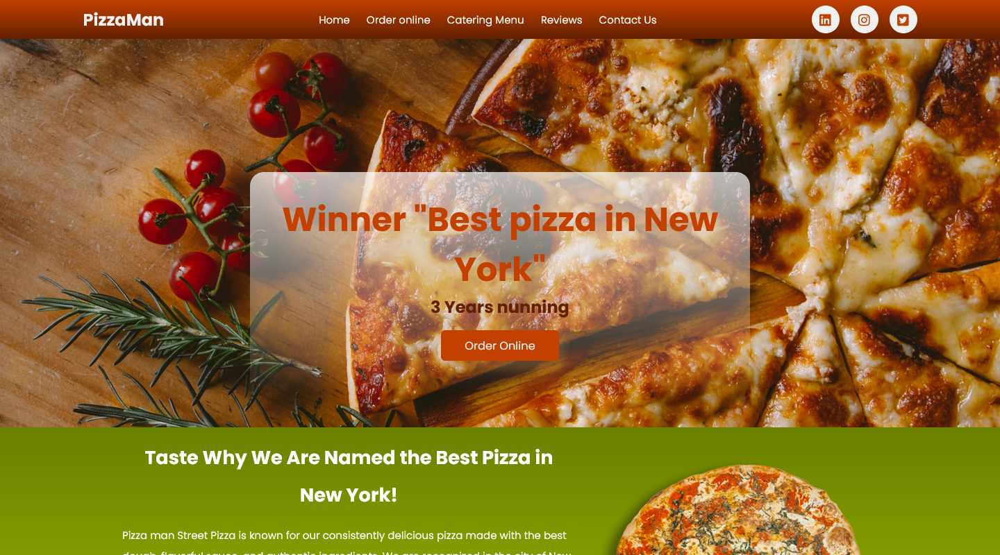

# PizzaMan - A pizza resturant landing page

## Overview

### The challenge

Users should be able to:

- View the optimal layout for the site depending on their device's screen size
- See hover states for all interactive elements on the page

### Links

- [👉 Click here to see Live preview👈]()

## My process

### Built with

- Semantic HTML5 markup
- Flexbox
- CSS Grid
- Mobile-first workflow

## Author

- LinkedIn - [@CodePapa360](https://www.linkedin.com/in/codepapa360)
- Twitter - [@CodePapa360](https://www.twitter.com/CodePapa360)
- Frontend Mentor - [@CodePapa360](https://www.frontendmentor.io/profile/CodePapa360)

### Screenshot

#### Desktop preview

#### Mobile preview 

